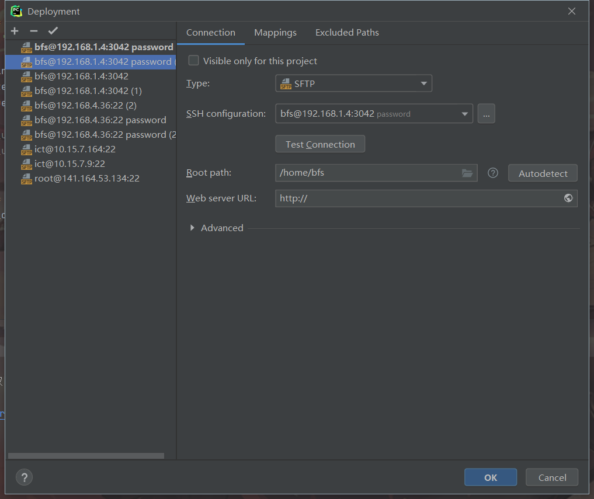

# 环境搭建

## 安装anaconda

### 配置清华源

```shell
vim .condarc
```

```ini
channels:
  - defaults
show_channel_urls: true
default_channels:
  - http://mirrors.tuna.tsinghua.edu.cn/anaconda/pkgs/main
  - http://mirrors.tuna.tsinghua.edu.cn/anaconda/pkgs/free
  - http://mirrors.tuna.tsinghua.edu.cn/anaconda/pkgs/r
custom_channels:
  conda-forge: http://mirrors.tuna.tsinghua.edu.cn/anaconda/cloud
  msys2: http://mirrors.tuna.tsinghua.edu.cn/anaconda/cloud
  bioconda: http://mirrors.tuna.tsinghua.edu.cn/anaconda/cloud
  menpo: http://mirrors.tuna.tsinghua.edu.cn/anaconda/cloud
  pytorch: http://mirrors.tuna.tsinghua.edu.cn/anaconda/cloud
  simpleitk: http://mirrors.tuna.tsinghua.edu.cn/anaconda/cloud
```


## 安装完成之后创建环境

```shell
conda create -n DCKG python=3.8
```


## 配置环境

### 安装服务器可以支持的pytorch版本

```shell
source activate DCKG
conda install pytorch torchvision torchaudio cudatoolkit=10.2 -c pytorch
```

### 下载对应版本的scatter

https://pytorch-geometric.com/whl/

```sh
pip install torch_scatter-2.0.9-cp38-cp38-linux_x86_64.whl
```

其他环境直接pycharm一键安装就行


## 配置服务器远程连接




## 创建git

```shell
PS D:\PycharmProject\DCKG> git remote add origin https://github.com/WarmLight7/DCKG-master.git
PS D:\PycharmProject\DCKG> git branch -M main
PS D:\PycharmProject\DCKG> git push -u origin main

```


## 模型理解

### 数据集结构

#### last-fm

**user_list**:用户列表

```json
{//从0开始的编号
    org_id: "原始编号",
    remap_id: "重新映射后的编号"
}
```

item_list:物品列表

```json
{//从0开始的编号
    org_id: "原始编号",
    remap_id: "重新定义后的编号",
    freebase_id: "数据集编码"
}
```

entity_list:物品和物品属性列表

```json
{//编码从0到n_item为物品编号，从n_item开始为物品属性编号
    org_id: "数据集编号",
    remap_id: "重新定义后的编号",
}
```

kg_final:物品和物品属性交互三元组

```json
{
    pos_1: "物品",
    pos_2: "关系类型",
    pos_3: "物品属性"
}
```

attribute_list: 用户属性列表

```json
{
    attribute_id: "用户属性值",
    attribute_value: "用户属性编号",
    attribute_type: "用户属性类型"
}
```

attribute_kg:用户和用户属性交互三元组

```json
{
    pos_1: "用户",
    pos_2: "关系类型",
    pos_3: "用户属性"
}
```

#### 
